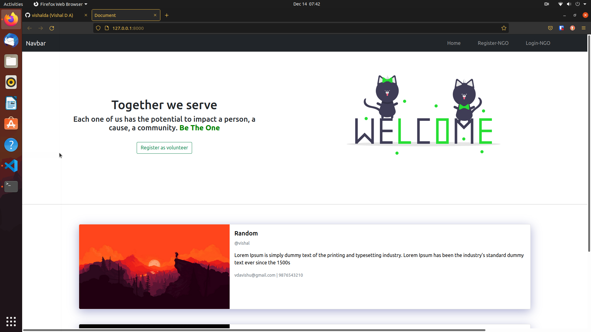
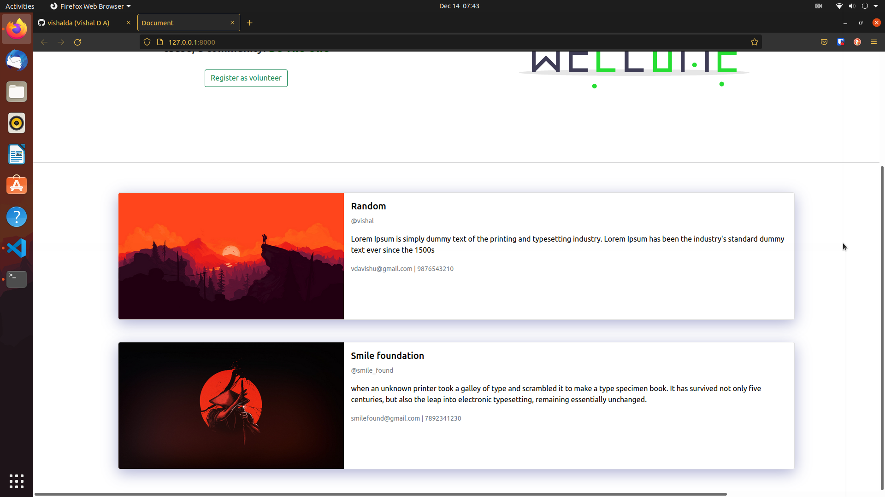
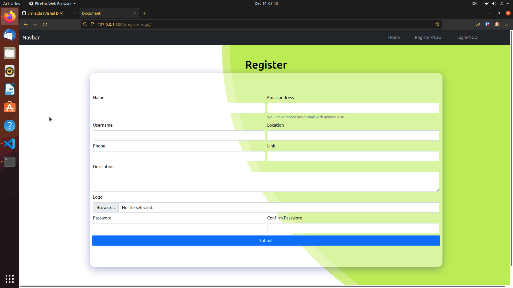
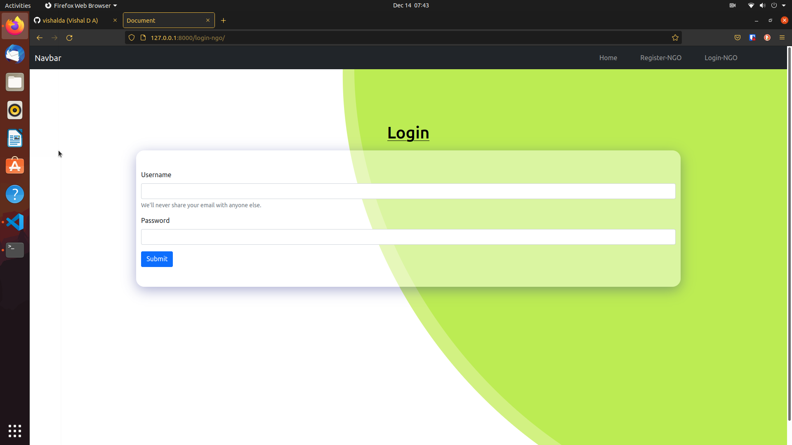
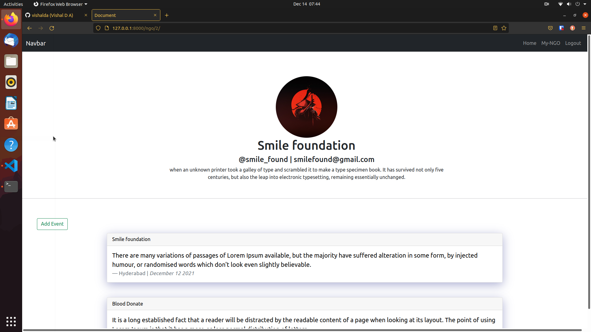
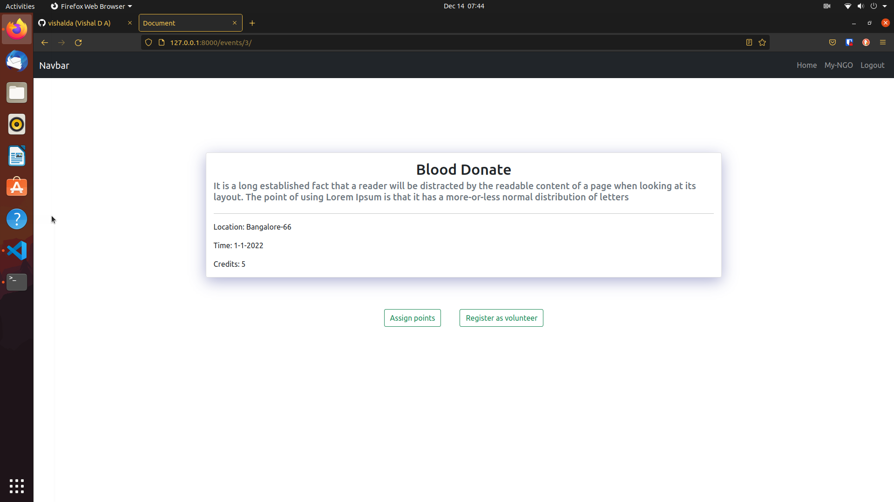
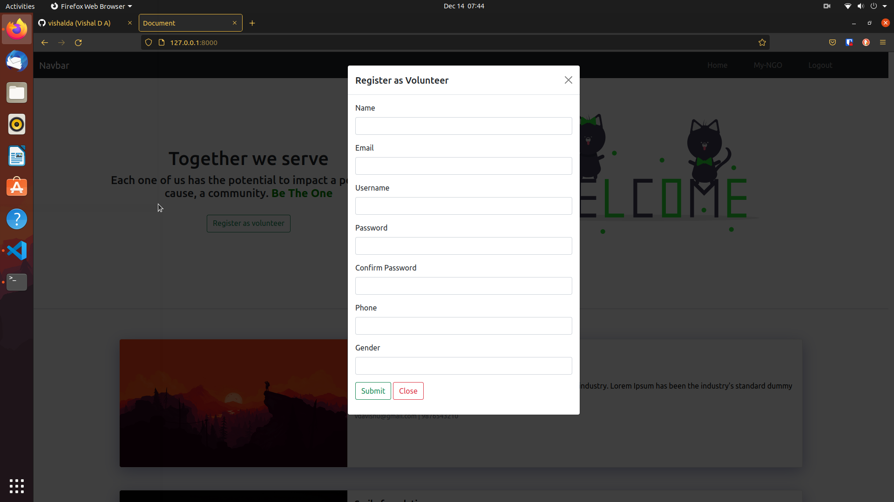

# Aashwan

“Aashwan” is a management system for NGO’s. In this system,different NGO’s around India can register their organisation with us and host their events and get volunteer’s for their event’s.

This is designed by using Django as both backend and frontend and DBSqlite3 for the Database part.

Feel free to open a pull request or use this project.

---

## Features

- CRUD(Create, Read, Update Delete) operation for NGO’s
- CRUD operation of event’s
- Registering and unregistering of volunteer’s
- Credit points for volunteer's on successfull completion of event

---

## Screenshots

